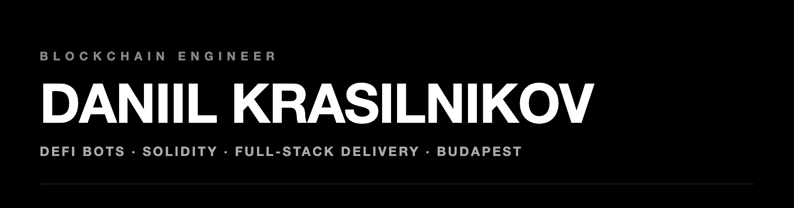

Budapest, Hungary · [krasilnikoff.dev](https://krasilnikoff.dev)

Build fast. Be useful. Iterate.

---

## NOW

- I build automated trading systems for DeFi protocols: Solidity, on-chain execution, algorithmic strategy code.
- I ship the product around them: React Native trading apps, microservices, CI/CD.
- Open to blockchain / Web3 engineering roles.

---

## TRACK RECORD

| Where | What |
|---|---|
| **Bourse Direct** | Senior Forward Deployed Engineer. Refactored 3 core microservices and automated the CI/CD pipeline. Deploy and integration time down 50%. |
| **Private trading firm** | Blockchain Engineer & Researcher. Designed production DeFi trading bots: Solidity smart contracts and on-chain execution strategies. |
| **[Terra.do](https://terra.do)** | Senior Frontend Developer. Cross-platform React Native app, App Store and Play Store releases, Next.js + Storybook. |
| **MobiOffice** | Frontend Engineer. Accessibility score up 20%. Test coverage to 82%. |

---

## PROJECTS

| Project | What it is |
|---|---|
| **[Willhappen](https://willhappen.io)** | Prediction markets on Hyperliquid. Prices come from HIP-4 order books. |
| **[Rosa Protocol](https://github.com/kovdanielgh/rosa-protocol)** | Open-source communication protocol for decentralized robot swarms. |
| **[DeFi Trading Bots](https://krasilnikoff.dev/work/defi-trading-bots)** | Production bots with Solidity contracts on Ethereum and BSC. Code is private. |

More on [krasilnikoff.dev](https://krasilnikoff.dev/work).

---

## STACK

```
Solidity · smart contracts · DeFi protocols · on-chain execution
TypeScript · React · Next.js · React Native
Microservices · CI/CD · Rust · C++ · ROS · IoT · Edge AI
```

---

## CONTACT

[Portfolio](https://krasilnikoff.dev) · [LinkedIn](https://www.linkedin.com/in/daniel-krasilnikoff/) · [Email](mailto:kovdaniel.job@gmail.com)
